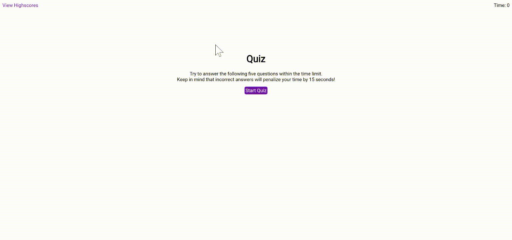

# 2-22-21-Homework
# 04 Web APIs: Code Quiz

This application is a multiple choice quiz! The quiz is timed, and the user loses time if they choose incorrect answers. At the end of the quiz, users can store their initials and score into local storage for future viewing.

The quiz can be found [here](https://elisesamanthadaly.github.io/2-22-21-Homework/).

## Usage

Click the "Start Quiz" button to begin.

The timer can be seen during the quiz in the upper righthand corner. Users begin with 75 seconds to complete the quiz.

For each of the five questions, click one of the answer choice (a - d) buttons to proceed.

An alert flashes in the center of the screen after each question, displaying whether the selected answer choice was correct or incorrect.

Selecting incorrect answers incurs a time penalty of 15 seconds.

When the user finishes the quiz (or if the timer runs out before the quiz is finished), previous highscores are displayed. The user also can input their initials to store their current score, or clear previous highscores.

Click the "Go Back" button to start the quiz over.

At any time during the quiz, the "View Highscores" button in the upper lefthand corner can be clicked to display previous highscores. This stops any currently running quiz.

## Credits

Where would any of us be without [w3schools...](https://www.w3schools.com/).

Also, [Google Fonts](https://fonts.google.com/) must be credited for the ever-popular Roboto font.

Finally, [Wikipedia, the free encyclopedia](https://en.wikipedia.org/wiki/Cavendish_banana) is always a great resource for filler text.

## License

MIT License

Copyright (c) 2021 Elise Daly

Permission is hereby granted, free of charge, to any person obtaining a copy
of this software and associated documentation files (the "Software"), to deal
in the Software without restriction, including without limitation the rights
to use, copy, modify, merge, publish, distribute, sublicense, and/or sell
copies of the Software, and to permit persons to whom the Software is
furnished to do so, subject to the following conditions:

The above copyright notice and this permission notice shall be included in all
copies or substantial portions of the Software.

THE SOFTWARE IS PROVIDED "AS IS", WITHOUT WARRANTY OF ANY KIND, EXPRESS OR
IMPLIED, INCLUDING BUT NOT LIMITED TO THE WARRANTIES OF MERCHANTABILITY,
FITNESS FOR A PARTICULAR PURPOSE AND NONINFRINGEMENT. IN NO EVENT SHALL THE
AUTHORS OR COPYRIGHT HOLDERS BE LIABLE FOR ANY CLAIM, DAMAGES OR OTHER
LIABILITY, WHETHER IN AN ACTION OF CONTRACT, TORT OR OTHERWISE, ARISING FROM,
OUT OF OR IN CONNECTION WITH THE SOFTWARE OR THE USE OR OTHER DEALINGS IN THE
SOFTWARE.